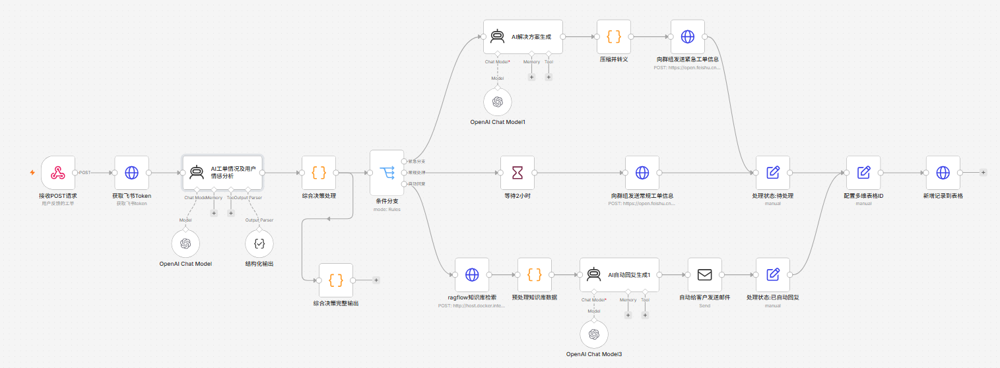

<div align="center">
  <h1>🎫 AI Ticket System — n8n Workflow</h1>
  <p><strong>7×24 无人值守智能工单分诊自动化工作流</strong></p>
  <p><em>7×24 Unattended Intelligent Ticket Triage Automation Workflow</em></p>

  <p>
    
    
    
    
    
  </p>
</div>

---

## 📋 项目简介 | Overview

本项目是一个基于 **n8n** 构建的 **7×24小时无人值守工单分诊自动化工作流**，支持自动接收、分析、分类和响应客户工单。通过 AI Agent 智能分析工单内容，自动判断紧急程度，并执行相应的处理流程。

> **核心特性：**
>
> - 🔌 **Webhook 接收** — 通过 HTTP API 接收工单请求
> - 🤖 **AI 智能分析** — 使用 LLM 自动分析工单情感、紧急程度、问题分类
> - 🔀 **三级决策引擎** — 紧急 / 常规 / 自动回复 三级智能分流
> - 📧 **邮件自动回复** — 常规问题 AI 自动生成回复邮件
> - 📱 **飞书集成** — 群组消息通知 + 多维表格存储
> - 📚 **RAG 知识库** — 接入 RagFlow 知识库提升回复准确性
> - ⏱ **定时升级** — 常规工单超时未处理自动升级提醒

---

## 🏗 工作流架构 | Workflow Architecture

```
┌─────────────────────────────────────────────────────────────┐
│                      Webhook 接收工单                          │
│                    (接收POST请求)                             │
└─────────────────────┬───────────────────────────────────────┘
                      │
                      ▼
┌─────────────────────────────────────────────────────────────┐
│                  获取飞书 Token (认证)                         │
└─────────────────────┬───────────────────────────────────────┘
                      │
                      ▼
┌─────────────────────────────────────────────────────────────┐
│             AI 工单分析 (情感 + 紧急度 + 分类)                    │
│           • 情感分析 (positive/neutral/negative/angry)        │
│           • 紧急度 (critical/high/medium/low)                │
│           • 分类 (billing/technical/bug/general)             │
│           • 是否需要人工介入判断                                │
└─────────────────────┬───────────────────────────────────────┘
                      │
                      ▼
┌─────────────────────────────────────────────────────────────┐
│                   三级决策引擎 (条件分支)                         │
└──────────┬──────────────┬──────────────┬───────────────────┘
           │              │              │
     ⚠️ 紧急分支      📋 常规分支     🤖 自动回复分支
           │              │              │
           ▼              ▼              ▼
    ┌──────────┐   ┌──────────┐   ┌──────────────┐
    │AI 解决方案│   │等待2小时  │   │RagFlow 知识库│
    │  生成     │   │ (静默期)  │   │    检索      │
    └────┬─────┘   └────┬─────┘   └──────┬───────┘
         │              │                │
         ▼              ▼                ▼
    ┌──────────┐   ┌──────────┐   ┌──────────────┐
    │飞书群消息 │   │飞书群消息 │   │AI 自动回复   │
    │(紧急通知) │   │(常规通知) │   │  生成        │
    └────┬─────┘   └────┬─────┘   └──────┬───────┘
         │              │                │
         └──────┬───────┘                │
                │                        ▼
                ▼                  ┌──────────────┐
         ┌────────────┐            │发送邮件给客户 │
         │飞书多维表格 │            └──────┬───────┘
         │ (数据存储)  │                   │
         └────────────┘                   ▼
                                    ┌──────────────┐
                                    │飞书多维表格   │
                                    │ (标记已回复)  │
                                    └──────────────┘
```

> 详细架构图：参考下方截图 👇
>
> 

---

## 🚀 快速开始 | Quick Start

### 前置准备 | Prerequisites

| 项目 | 说明 |
|------|------|
| [n8n](https://n8n.io/) | v1.80+ (自托管或云端均可) |
| LLM API Key | 兼容 OpenAI API 格式（如 [nangeai.top](https://nangeai.top/)） |
| SMTP 邮箱 | 用于发送自动回复邮件（本示例使用 163 邮箱） |
| 飞书应用 | 用于群组消息通知和多维表格存储 |
| [RagFlow](https://ragflow.io/) | (可选) 知识库检索系统 |

### 导入步骤 | Import Steps

1. **克隆仓库**
   ```bash
   git clone https://github.com/YoungB1oodXD/ai-ticket-system.git
   cd ai-ticket-system
   ```

2. **准备工作流**
   - 复制模板文件并重命名（或直接使用模板导入后编辑占位符）：
   ```bash
   cp workflow/ticket-workflow.template.json workflow/my-ticket-workflow.json
   ```
   - 打开 n8n 管理界面
   - 进入 **Workflows** → **Import from File**
   - 选择你的工作流文件

3. **替换占位符 | Replace Placeholders**
   - 工作流模板中的 `{{YOUR_XXX}}` 占位符需要替换为你的真实凭证
   - 参考 [.env.example](.env.example) 了解每个配置项的说明：
     - 🔑 **OpenAI / LLM API** — 凭证 ID
     - 📧 **SMTP** — 发件邮箱配置
     - 🔐 **Header Auth** — Webhook 鉴权
     - 🌐 **飞书** — 应用凭证 + 表格/群聊 ID
     - 📚 **RagFlow** — API Key + 数据集 ID

4. **激活工作流**
   - 点击 **Active** 按钮启用工作流
   - 复制 Webhook 生产 URL

### 🔒 关于凭证安全 | About Credential Security

> ⚠️ **工作流 JSON 文件中不应包含真实凭证！**
>
> 本仓库提供的是 `workflow/ticket-workflow.template.json`（所有凭证已替换为占位符），你的本地工作流文件（含真实凭证）已通过 `.gitignore` 排除，不会被提交到 GitHub。
>
> 如需在 n8n 中使用，建议：
> 1. 导入模板文件到 n8n
> 2. 在 n8n 界面中创建和管理凭证（Credentials）
> 3. 在工作流编辑器中直接选择已创建的凭证
>
> 详细凭证说明见 [.env.example](.env.example)。

---

## 🧪 测试 | Testing

项目提供了两种测试方式：

### 方式 1：批量测试脚本（推荐）

```bash
# 设置你的 n8n Webhook 地址
export N8N_WEBHOOK_URL=http://localhost:5678/webhook-test/你的webhookID
export N8N_AUTH_HEADER=你的认证头

# 一键运行所有测试用例
bash tests/run-tests.sh
```

### 方式 2：Apifox 可视化测试

> 项目提供了 Apifox 导出文件 `n8n测试.apifox.json`（位于项目根目录，已被 .gitignore 排除）

### 测试覆盖场景

| 场景 | 文件 | 预期触发分支 |
|------|------|-------------|
| 🚨 紧急工单 - 支付问题 | `tests/case-urgent.json` | 紧急 → 飞书通知 + AI 方案 |
| 📋 常规工单 - 技术问题 | `tests/case-normal.json` | 常规 → 等待 2h + 通知 |
| 🤖 自动回复 - 普通咨询 | `tests/case-auto-reply.json` | 自动回复 → 知识库 + 邮件 |
| ⚠️ 空字段边界 | `tests/case-edge-empty.json` | 容错处理 |
| ⚠️ 超长文本边界 | `tests/case-edge-long-text.json` | 大数据量处理 |
| 😤 情绪激动边界 | `tests/case-edge-emotional.json` | 应触达紧急分支 |

---

## 🧩 核心节点说明 | Core Nodes

### 1. Webhook 节点
接收外部 HTTP 请求触发工作流。支持自定义路径、多种认证方式和 CORS 配置。

### 2. AI Agent 节点 (LLM)
- **工单分析 Agent** — 分析情感、紧急度、问题分类，支持结构化 JSON 输出
- **解决方案 Agent** — 为紧急工单生成即时的处理方案
- **自动回复 Agent** — 结合知识库内容生成专业回复

### 3. 三级决策引擎
基于 AI 分析结果自动决策：
- **紧急分支** → 即时通知 → AI 生成解决方案 → 飞书群 @所有人
- **常规分支** → 等待 2 小时 → 群组通知 → 多维表格记录
- **自动回复分支** → RagFlow 检索 → AI 生成回复 → 邮件发送客户

### 4. Code 节点
- 数据校验与格式化
- 知识库内容预处理
- 调试日志输出

### 5. HTTP Request 节点
- 飞书 Token 获取
- 群组消息发送
- 多维表格记录新增
- RagFlow 知识库检索

---

## ⚙️ 配置参考 | Configuration Reference

### 邮箱 SMTP
```
SMTP 服务器: smtp.163.com
端口: 465 (SSL) 或 25
```

### 飞书 API
| 接口 | 用途 |
|------|------|
| `GET /open-apis/auth/v3/tenant_access_token/internal` | 获取认证 Token |
| `POST /open-apis/im/v1/messages` | 发送群组消息 |
| `POST /open-apis/bitable/v1/apps/{app}/tables/{table}/records` | 新增表格记录 |

---

## 📂 项目结构 | Project Structure

```
ai-ticket-system/
├── README.md                               # 项目说明文档
├── .gitignore                              # Git 忽略配置
├── .env.example                            # 环境变量模板（凭证说明）
├── img.png                                 # 工作流架构图
├── workflow/
│   ├── ticket-workflow.template.json       # [推送到Git] 脱敏的工作流模板
│   └── 7x24小时ai工单分诊自动化工作流.json  # [本地] 含真实凭证，被 gitignore
├── tests/                                  # 轻量测试方案
│   ├── README.md                           # 测试使用说明
│   ├── run-tests.sh                        # 批量测试脚本 (curl)
│   ├── case-urgent.json                    # 测试用例：紧急工单
│   ├── case-normal.json                    # 测试用例：常规工单
│   ├── case-auto-reply.json                # 测试用例：自动回复
│   ├── case-edge-empty.json                # 边界测试：空字段
│   ├── case-edge-long-text.json            # 边界测试：超长文本
│   └── case-edge-emotional.json            # 边界测试：情绪激动
└── scripts/
    └── generate_template.py                # 模板生成脚本
```

---

## 📺 视频教程 | Video Tutorials

- **YouTube**: [n8n 配置 7x24 小时无人值守工单分诊自动化](https://youtu.be/zhSKnqJa9to)
- **B站**: [对应视频教程](https://www.bilibili.com/video/BV1aD2TBsEkZ/)
- **相关教程**: [n8n 配置飞书保姆级指南](https://youtu.be/zhSKnqJa9to)

---

## 🤝 贡献 | Contributing

欢迎提交 Issue 和 Pull Request 来改进这个项目！如果有任何问题或建议，请随时联系我们。

---

## 📄 许可证 | License

本项目基于 MIT 协议开源。详情参见 [LICENSE](LICENSE) 文件。

---

<p align="center">
  <sub>Made with ❤️ by <a href="https://github.com/YoungB1oodXD">YoungB1oodXD</a></sub>
  <br>
  <sub>Built with <a href="https://n8n.io/">n8n</a> · <a href="https://openai.com/">OpenAI</a> · <a href="https://www.feishu.cn/">飞书</a> · <a href="https://ragflow.io/">RagFlow</a></sub>
</p>
